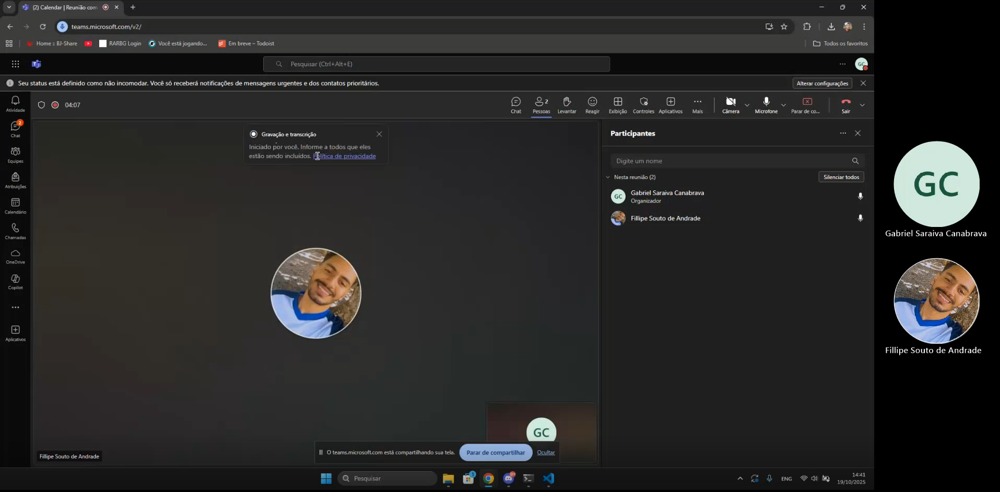

# Greed

Temas:
- Greed

**Número da Lista**: 34<br>
**Conteúdo da Disciplina**: Algoritmo Guloso <br>

## Alunos
|Matrícula | Aluno |
| -- | -- |
| 20/2045769  |  Gabriel Saraiva Canabrava|
| 19/0087188  |  Fillipe Souto de Andrade |

## Sobre 

Este projeto implementa um sistema de agendamento de tarefas utilizando o **algoritmo guloso (Greedy)** para otimizar a seleção de tarefas que podem ser executadas sem conflitos de horário.

### Objetivo

Desenvolver uma aplicação web que permite aos usuários adicionar tarefas com horários específicos e automaticamente agendar o máximo número possível de tarefas não conflitantes, utilizando o algoritmo guloso de agendamento de intervalos.

### Tecnologias Utilizadas
- **Algoritmo Guloso (Greedy)**: Implementado para agendamento ótimo de tarefas sem conflitos
- **React**: Biblioteca JavaScript para construção de interfaces de usuário
- **Vite**: Build tool moderno e rápido para desenvolvimento frontend
- **CSS**: Estilização customizada para interface responsiva

### Funcionalidades
- Interface para adicionar tarefas com nome, horário de início e fim
- Validação de entrada de dados (nome da tarefa e horários)
- Algoritmo guloso para agendamento automático de tarefas
- Visualização em tempo real das tarefas pendentes e agendadas
- Contador de tarefas em cada categoria
- Botão para limpar todas as tarefas
- Exemplo pré-carregado com tarefas de demonstração

## Screenshots

### Interface Principal


### Adicionando Tarefas


### Tarefas Agendadas


## Instalação 

### Pré-requisitos
- Node.js (versão 18 ou superior)
- npm ou yarn

### Tecnologias
- **Linguagem**: JavaScript
- **Framework**: React
- **Build Tool**: Vite

### Passos para instalação

1. Navegue até o diretório do projeto:
```bash
cd greed
```

2. Instale as dependências:
```bash
npm install
```

3. Execute o projeto em modo de desenvolvimento:
```bash
npm run dev
```

4. Acesse a aplicação no navegador:
```
http://localhost:5173
```

## Videos

### Demonstração do Projeto
[](https://teams.microsoft.com/l/meetingrecap?driveId=b%21byAPiRvdQ0-iKmwu_FVR41kMHcnSK4FFuXHlCED0xPjO_rdKdxVqSaho6GNdMlME&driveItemId=01PG3F4MLMG6BTAA2GQZC2SNTAY4QTXMZN&sitePath=https%3A%2F%2Funbbr-my.sharepoint.com%2F%3Av%3A%2Fg%2Fpersonal%2F202045769_aluno_unb_br%2FEWw3gzADRoZFqTZgxyE7sy0BiSDLdFJUT5hFocydVIkMvA&fileUrl=https%3A%2F%2Funbbr-my.sharepoint.com%2Fpersonal%2F202045769_aluno_unb_br%2FDocuments%2FGrava%25C3%25A7%25C3%25B5es%2FReuni%25C3%25A3o%2520com%2520Gabriel%2520Saraiva%2520Canabrava-20251019_144054-Grava%25C3%25A7%25C3%25A3o%2520de%2520Reuni%25C3%25A3o.mp4%3Fweb%3D1&threadId=19%3Ameeting_OTZlZmFjNjQtOWI4MS00ZDk4LTk4ZmYtNDM4MzIzZDMxMDJh%40thread.v2&organizerId=8e3bd2c9-5fe4-427a-a9b0-d7f2c92a5f2c&tenantId=ec359ba1-630b-4d2b-b833-c8e6d48f8059&callId=1ce191b5-3813-4bad-bac3-ecbe73849e3f&threadType=meeting&meetingType=MeetNow&subType=RecapSharingLink_RecapCore)

> **Clique na imagem acima para assistir à demonstração completa do projeto**